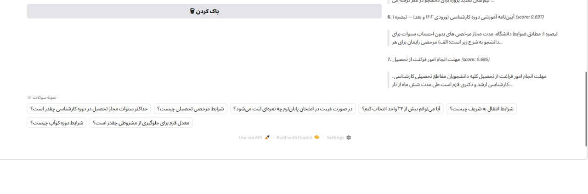
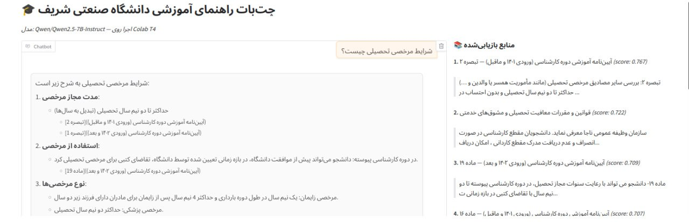

# Sharif University Educational Regulations Chatbot
RAG-Based Intelligent Question Answering System

An intelligent question-answering chatbot built using a **Retrieval-Augmented Generation (RAG)** architecture to provide accurate, grounded, and source-cited answers to students' questions about official university regulations.

---

# Project Overview

This project implements a domain-specific chatbot designed to answer students’ questions regarding official academic regulations.  

Unlike generic chatbots, this system:

- Retrieves information directly from official regulation documents
- Generates answers grounded in retrieved text
- Explicitly cites regulation names and article numbers
- Minimizes hallucinations using a constrained prompt strategy
- Runs efficiently on limited hardware via model quantization

The system is designed specifically for Persian-language academic documents but follows a scalable and modular architecture.

---

# System Architecture

The project consists of three major layers:

## 1 Knowledge Base Construction

- Parse raw HTML regulation files
- Remove non-content elements
- Normalize Persian text
- Perform structure-aware chunking
- Store structured chunks in JSON format

Output: chunks.json


---

## 2️ Vector Index Construction

- Convert each chunk into a 768-dimensional embedding
- Normalize embeddings for cosine similarity
- Build a FAISS vector index
- Store index and metadata

Outputs:

faiss.index
chunks_meta.pkl


---

## 3️ RAG Engine + Web Interface

Full response pipeline:


User Question
⭢
Question Embedding
⭢
FAISS Semantic Search (Top-K)
⭢
Context Construction
⭢
Prompt Engineering
⭢
LLM Generation
⭢
Answer + Source Display


---

# Features

## RAG-Powered Question Answering
The system retrieves the most relevant regulation clauses before generating a response, ensuring answers are grounded in official documents.

## Semantic Search Over Regulations
Embedding-based similarity search enables accurate retrieval even when the user's wording differs from the original regulation text.

## Article-Level Smart Chunking
Documents are split according to legal structure:
- Article (ماده)
- Clause (بند)
- Note (تبصره)
- Chapter (فصل)
- Section (بخش)

Fallback sliding window:
- 250-word chunks
- 50-word overlap

## 🔗 Source Attribution
Every generated answer references:
- Regulation name
- Article or clause number

This ensures traceability and transparency.

## Persian Text Optimization
Includes:
- Arabic-to-Persian character normalization
- Half-space cleanup
- Multi-space removal
- Preprocessing optimized for Persian embeddings

## Fast Local Vector Search
Uses FAISS (CPU-based) for efficient similarity search over thousands of chunks without external services.

## Prompt-Controlled LLM Behavior
The system enforces strict response constraints:
- Only use retrieved context
- Always cite article numbers
- Avoid hallucination
- Explicitly state if context is insufficient

## Interactive Web Interface
Built with Gradio:
- Chat interface
- Retrieved source display
- Similarity score visibility
- Public link via `share=True`

## Configurable Retrieval Depth
Top-K retrieval (default: 7) adjustable for performance/accuracy trade-offs.

## Lightweight Deployment
Can run on:
- Google Colab (T4 GPU)
- Local GPU (with quantization)
- CPU for indexing stage

---

# Tech Stack

## Backend
- Python 3.10+
- BeautifulSoup (HTML parsing)
- FAISS (Vector Search)
- JSON + Pickle (Storage)

## Embedding Model
- paraphrase-multilingual-mpnet-base-v2
- 768 dimensions
- Cosine similarity via normalized inner product

## Large Language Model
- Qwen2.5-7B-Instruct
- 4-bit NF4 quantization (BitsAndBytes)
- Optimized for T4 GPU (15GB VRAM)

---

# Data Pipeline

## Input
26 official HTML regulation files.

## Processing Steps
1. HTML cleaning (remove header, footer, nav, scripts)
2. Persian normalization
3. Structure-aware chunk detection
4. Sliding window fallback for long sections

## Output

chunks.json
faiss.index
chunks_meta.pkl


---

# Retrieval Strategy

- Embedding-based semantic similarity
- Cosine similarity via normalized embeddings
- Top-K retrieval (default: 7)
- Sliding window fallback for long articles
- Suitable for ~1K–5K chunks

# Running the Project on Google Colab

Follow these steps to run the project.

---

# Step 1 — Prepare Files
You must upload:

- build_kb.py (if needed)
- build_index.py (if needed)
- chatbot-related files
- faiss.index
- chunks_meta.pkl
- chunks.json

---

# Step 2 — Open Google Colab

1. Go to https://colab.research.google.com
2. Create a New Notebook
3. Enable GPU:

Runtime → Change runtime type → GPU → Save

---

# Step 3 — Upload Project Files

On the left panel:

Files → Upload → Select all project files (NOT the zip)

Make sure these files are visible:


# Example Workflow

If a user asks:

> What is the maximum allowed study duration?

The system:

1. Embeds the question  
2. Retrieves the top 7 most relevant regulation chunks  
3. Constructs a unified context  
4. Builds a constrained prompt  
5. Generates a grounded response  
6. Displays the answer along with cited sources  

---

# How to work with

## Clone Repository
```bash
git clone https://github.com/your-username/sharif-rag.git
cd sharif-rag
```

## Install Dependencies
```python
pip install transformers accelerate bitsandbytes
pip install sentence-transformers
pip install faiss-cpu
pip install numpy
pip install gradio
pip install groq
pip install sqlalchemy
pip install fastapi uvicorn
pip install langchain
pip install langfuse
```
## Then create a file called run.py and run:
```
python run.py
```


# Screenshots

Below are example screenshots of the system execution.





